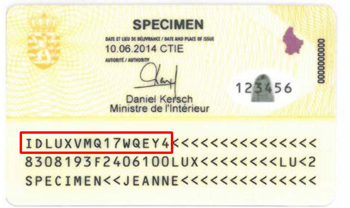
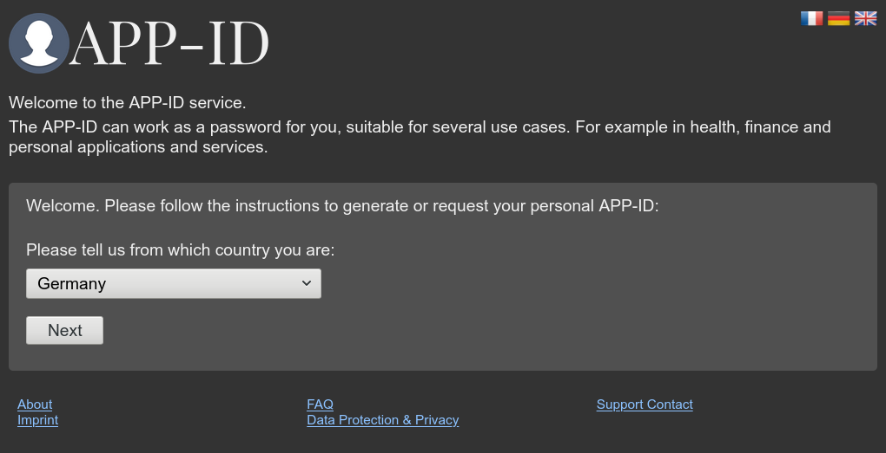
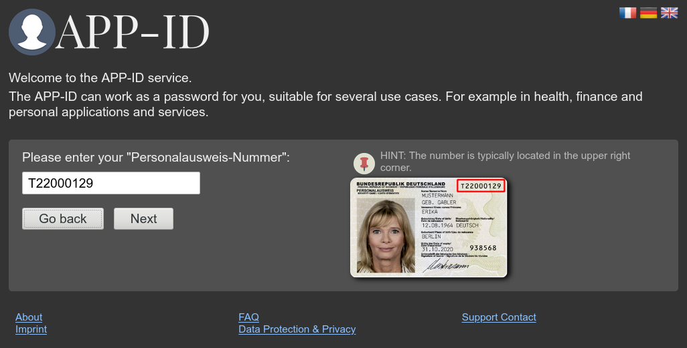
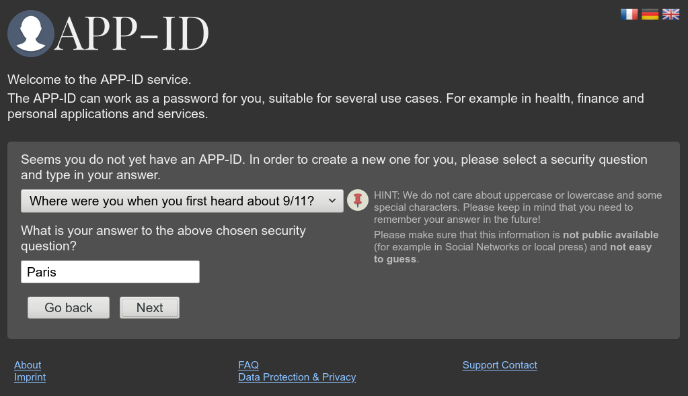
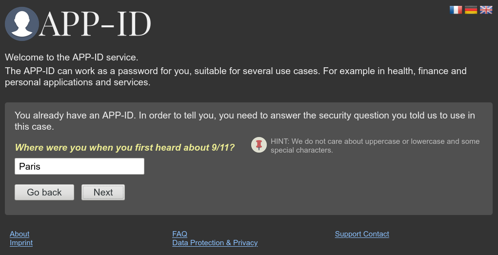
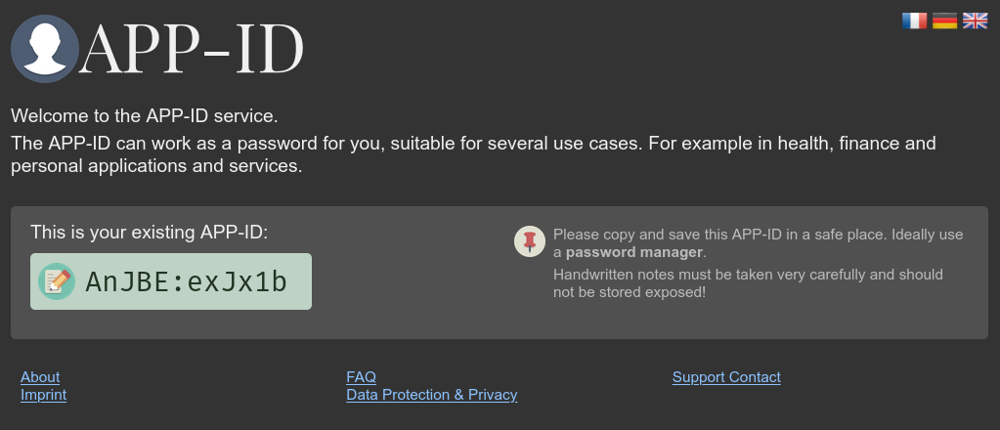
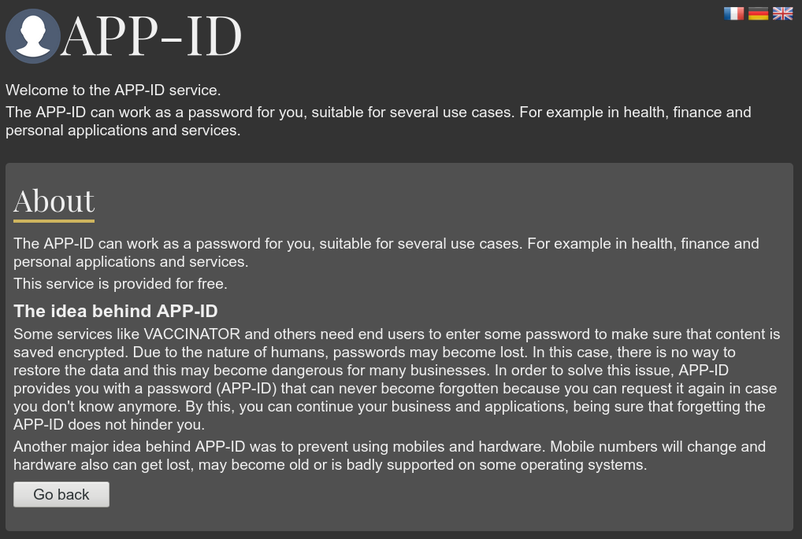
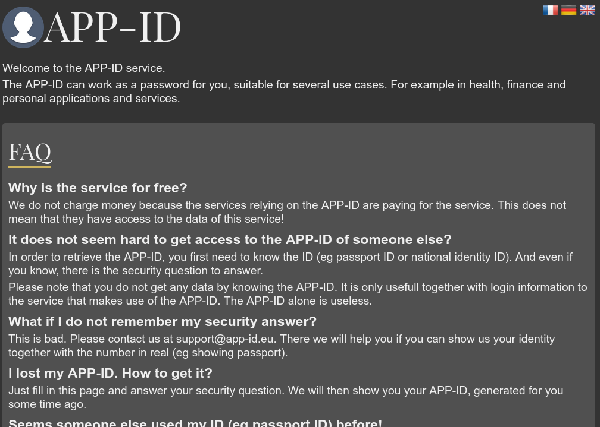
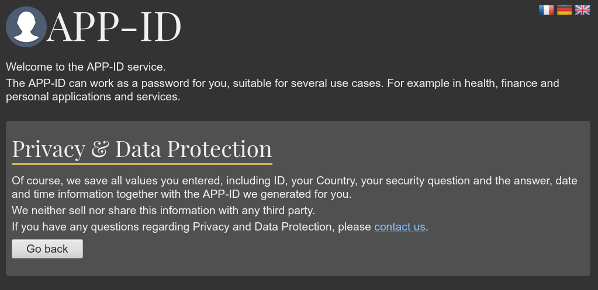
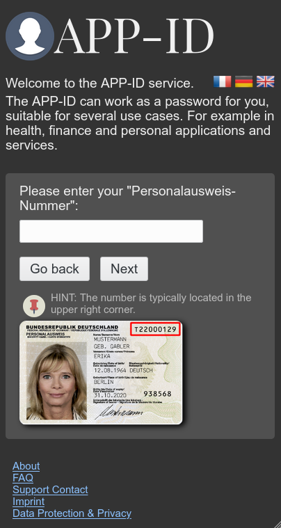

= APP-ID manual
:author: DataVaccinator Team 
:email: info@datavaccinator.com
:toc:
:doctype: book
ifdef::env-github[]
:tip-caption: :bulb:
:note-caption: :information_source:
:important-caption: :heavy_exclamation_mark:
:caution-caption: :fire:
:warning-caption: :warning:
endif::[]

== APP-ID

The APP-ID concept is introduced because of the following idea:

. In order to prevent pseudonymisation systems to host readable personal data, the data should be encrypted (like in https://www.datavaccinator.com[DataVaccinator]).

. It does not work if the pseudonymisation system holds the key to that data. Because knowing the key is knowing the content.

. The service providers should also do not have access to this key because in principle, they can impersonate their users and use this to get access to data stored in identity management to reverse pseudonymisation.

. Because of this, the only party allowed having a key to encrypt identities is *the end user* itself.

. Unfortunately, end users tend to forget passwords. If such encryption key is lost, pseudonymisation can not get reverted and the data is "useless" or even "lost" for the end user.

. In order to make sure that such encryption key is never lost and can get restored in need, we invented the APP-ID-Service.

. The APP-ID-Service will assign unique random passwords for end users based on personal identity (eg id card number or citizen numbers).

=== The APP-ID password

Passwords tend to have issues due to copy and paste errors, case sensitivity and others. To prevent issues in various situations where APP-ID's are requested from the user, the APP-ID inherits a checksum to prevent errors from the beginning.

APP-ID's look like this:

`1Ha6xo2u{mRT18`

It consists of two parts:

`nnnnnnnnnnnnCC` (in the example above it is `1Ha6xo2u{mRT` and `18`)

While `nnnnnnnnnn` stands for a random 12 digits password (which can also be more), the last `CC` part is the last byte of a SHA256 hashcode for the previous `nnnnnnnnnn` string in hex notation.

=== APP-ID generation

APP-ID *generation* is done this way:

. Hash password with SHA256 (result for above example is `5718c158e15e76aeb054176908d32bef09b5c9aa3165200b7f0ac7e136445018`)

. Take the last two characters from hashcode (here `18`) and lowercase them

. Add these to the end of the APP-ID

WARNING: If you re-generate a new APP-ID for an existing user (with a previous APP-ID), you are not allowed to hand out an APP-ID with the same checksum to that user. Generate a new APP-ID with a different checksum!

=== APP-ID validation

Due to this, APP-ID *validation* is easy:

. Strip the last two characters (`18`)

. Calculate SHA256 from the rest of the password

. Compare the last two characters of the lowercase hex hashcode to the stripped characters from the APP-ID (step 1).

. If they are the same, the password is fine.

=== APP-ID renewal

The renewal of an APP-ID is a rare case and only to be done if the existing APP-ID is considered insecure and no longer usable for the desired purpose. In this case, the old APP-ID has to be kept for reference. 

WARNING: The newly generated APP-ID is not allowed to have the same checksum as any previous one that was generated for that identity (eg passport number)!

=== Security considerations

We are aware of the fact that the key generation from the whole APP-ID means that the used key is known by the last 8 bit, because this is the checksum. Thus, complexity of the APP-ID as key is reduced by 8 bits. Due to some calculations the 12 digits random part, generated as APP-ID, is worth about 62 bits (respecting character classes and length). This is considered enough for protecting data like the {product} payload. We may increase length if security concerns coming up for this.

=== The APP-ID generation service

This is some online service providing APP-ID's for individuals. It is kept very simple and utilizes a very simple one-page interface to provide such APP-IDs.

The interface consists of those elements:

* Informational section (describing the purpose and usage of this service).

* Dropdown field to ask for users country (eg Luxembourg, Germany, France etc).

* Label to show the required information (eg "please enter your id card number like IDLUXVMQ17WQEY4).

* Example image where to find that information (see image below this list).

* Text field to enter the required information.

* Button to start request or reset all fields.

If the user enters his required information, the system checks if it is already requested before.

If yes, the system will ask the additional question chosen during initial request.

If no, the system asks you to chose a security question (dropdown) and enter the correct answer.

If the request is finished successfully, the site will display the APP-ID. Either the new generated one (initial) or the previously generated one (subsequential request).

If the request fails, it will display some help information with help for a manual process to get the APP-ID without knowing the answer any more. Possible solution would be a special email address where you can tell the phone number you can get reached to verify the values manually on phone.

=== Security implementation (web security)

The security of the APP-ID service is granted by several mechanisms:

. All SQL database access is using prepared statements to prevent any SQL injection.

. Numeric input values are always made numeric before used or compared (eg with intval()).

. A user is not allowed to have unlimited attempts to enter the answer to his security question (eg max 10 times).

. The site uses several techniques to ensure that no bots are using the service by accident (eg scanning robots).

. The security questions need to be careful chosen.

== APP-ID hosting

=== General information

The APP-ID service is based on *PHP* and *MySQL*. We suggest to run some *Apache* web server on some *Linux* operating system to host the application. Thus, it can be run on any *LAMP* stack (Linux, Apache, MySQL and PHP). We suggest to use some CentOS Server or Ubuntu Server operating system as we have good experience with them.

The application will need some public IP address with DNS record.

The website handles multiple languages and allows end users to generate and request their APP-IDs. It is initially translated to German, French and English.

Today, it does not offer any administration interface. If changes in database are needed (should not happen that often), they have to be done using SQL on the command line. If we start to know the common tasks, we might implement some administration web-pages, too.

=== Hardware prerequisites

The system is not very resource hungry. We suggest to start with this set-up:

. One virtual CPU (1 Single Core)
. 1GB of RAM
. 40GB of hard drive space

=== Data size estimation

A usual dataset per generated APP-ID is less than 256 bytes each (storage and logging in MySQL database). A MySQL database with 1 Mio APP-ID's will have a size of about 245MB (MegaBytes). Thus, the 40GB hard drive suggested above will fit for a long time.

=== Bandwidth estimation

A regular request for a new APP-ID or for requesting an existing APP-ID each consumes about 1,2MB. If some repeated requests are needed, we estimate about 2MB per call. With a maximum of about 300 requests per day (including some attacks), we assume a peak 600MB traffic/day.

== APP-ID usage notes

The APP-ID contains a checksum (last two digits) and we strongly suggest to not use it as a password directly. Instead, you should use a hashcode of this APP-ID to use it as a password (like sha256 to get a 256 bit key). Also, consider adding a salt.

== APP-ID Screenshots

=== APP-ID generation

* Step 1, asking for country:

* Step 2, asking for required information (eg passport number):

* Step 3, asking for a security question including answer:

* Step 4, display newly generated APP-ID:

=== APP-ID request

* Step 1, asking for country:

* Step 2, asking for required information (eg passport number):

* Step 3, asking security question:

* Step 4, display stored APP-ID:

=== Special pages

About:

FAQ (partial):

Data Protection & Privacy:

=== Mobile layout

On mobile devices, the layout automatically switches to a better readable and usable form.
Example for Step 2.

